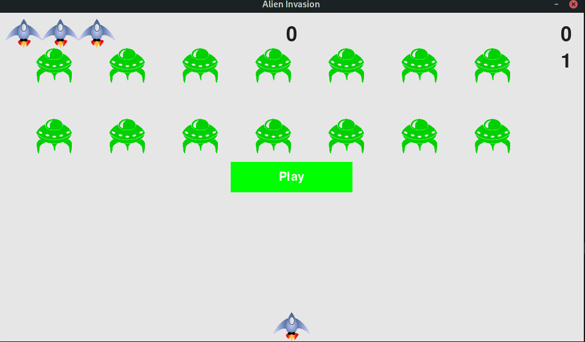

# Pylien Invasion
This project is an attempt to implement a basic Alien Invasion game.

## Table of contents
* [General info](#general-info)
* [Screenshots](#screenshots)
* [Technologies](#technologies)
* [Setup](#setup)
* [Features](#features)
* [Launch](#launch)
* [Documentation](#documentation)
* [Status](#status)
* [Inspiration and Sources](#inspiration-and-sources)
* [Contact](#contact)

## General info
The player controls a space ship appearing at the bottom center of the screen of the game.
The player can move the ship right and left with the arrow keys of the keyboard and shoot bullets with the spacebar of the keyboard. At the beginning of the game, a fleet of aliens ships fills the upper side of the screen and moves across and down the screen game. The player has to shoot all the aliens, after that a new alien fleet appears that moves faster than the previous one. If an alien hits the player's space ship or reaches the bottom of the screen then the player loses a ship. If the player loses three ships, the game ends. 

## Screenshots


## Technologies
* pygame - version 2.0.1
* python - version 3.9

## Setup
Read the instructions to install all dependencies to launch the game.

### On Linux:
If you have Linux, you already have python. You simply have to install pygame via pip:
```bash
pip install pygame
```
Or via your repository of your linux distro.

### On Windows:
No tests have been launched on Windows for the moment.

## Features
* Moving ship's player at the bottom of the screen with right and left keys.
* Bullets shooting from player's ship with spacebar.
* Alien fleet moves from up to down and from left to right.
* Max score written at the top of the screen.
* The three lives of the player are displayed at the top left of the screen.
* The levels are displayed at the top right of the screen.
* A "Play" button is displayed before beginning the game and at the end of the game, when all lifes are consummed, to reset the game and to continue to play.
* The current score of a game is displayed at top right of the screen.
* When the game is played, the mouse is hidden.
* Alien fleet's speed increase each time the player clears a level.

To-do list:
* Max score are not saved when the game is shutdown.

## Launch
To launch the game, read the instruction corresponding to your OS.

## Documentation
A HTML documentation of all the modules can be found [here](https://github.com/flavienChamay/pylien_invasion/tree/main/documentation).

### On Linux
Launch a terminal window into the source of the game and type:
```bash
python alien_invasion.py
```

### On Windows

## Status
This project is _in progress_.

## Inspiration and Sources
Project based on tutorials of [Eric Matthes](https://github.com/ehmatthes).

## Contact
Written by [Flavien Chamay](mailto:flavien.chamay@protonmail.com)
